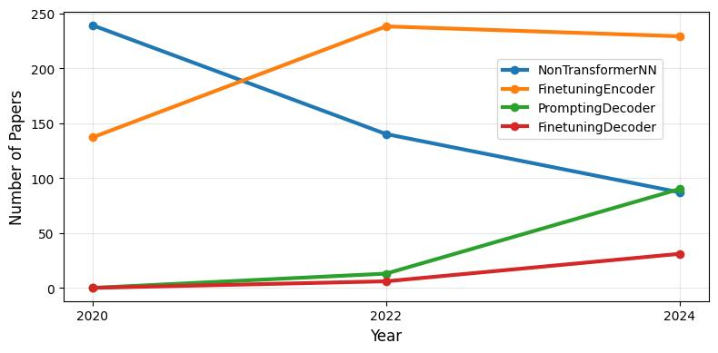

# Analyses of papers from the ACL Anthology
[English README here]()

In the ACL Anthology there are over a hundred thousand papers related to language technology. In this repository there is code that lets us:

1. [Using the `aclanthology` package](acl_sa-stats.ipynb) to read through the titles and abstracts of all papers and extract those of interest.
1. [Use Mistral OCR](acl_ocr.ipynb) to convert the papers to Markdown.
1. [Use google/gemini-2.5-flash](acl_analysis-api.ipynb) to read the content and categorize the texts according to the prompt.
1. [Compile and present the findings](acl_analysis-plot.ipynb)

In our case, we want to analyze trends in modeling for sentiment analysis. In step 1) we set the years we are interested in, and the text "sentiment" that should be present in the abstracts of the papers we want to examine. In step 2) we stitch together the pages we get back and cut off at `# References`. In step 3) we instruct the classification with the [prompt](analysis_prompt.txt) we have chosen. In step 4) we aggregate the results and conduct an additional investigation on the most interesting cases.

Remember that if we do not quality-assure the results, they are only _estimates_ of what the papers contain.

Markdown and classification results for the 37 papers found to contain modeling experiments though fine-tuning decoder models are [available here](FinetuningDecoder_papers.jsonl).
